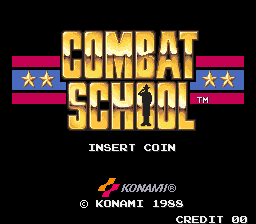
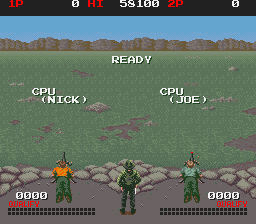
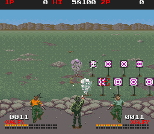
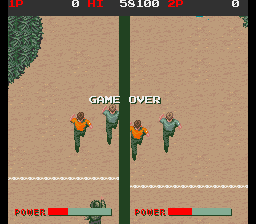
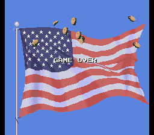

# KONAMI 007121 Arcades Conversion to FPGA by Jotego

Konami developed a graphic chip called 007121. This was used in several games.
This project aims to accurately replicate those games in modern electronics,
namely FPGA systems.

# Arcade Titles

Name            | JT Core | Main CPU   | Sound CPU  | K007121 units | Audio
----------------|---------|------------|------------|---------------|-------------
Contra          | contra  | HD63C09EP  | 68B09EP    | x2            | YM2151
Combat School   | comsc   | 6309       | Z80        | x2            | YM2203 + UPD7759
Haunted Castle  |         | KONAMI     | Z80        | x2            | YM3812 + K051649
Fast Lane       |         | 6309       | -          | x2 + K051733  | K007232 x 2
MX5000          |         | 6309       | Z80        | x1            | YM2151 + K007232
Labyrinth Runner|         | 6309       | -          | x1 + K051733  | YM2203 x 2

# Supported FPGA Platforms

Binary RBF files for MiST, MiSTer and SiDi will be provided for in
https://github.com/jotego/jtbin

# Compiling

You need to have Quartus installed in a linux machine. Clone this repository and
its submodules following standard git instructions. Go to the root folder and
type `source setprj.sh`. Now you can compile the core with `jtcore contra -mist`
Use `-mister` or `-sidi` if appropriate.

# ROM file

Use the mra file in rom/mra for MiSTer. For MiST/SiDi, convert the mra to a rom
file using the mra tool.

# External Modules Used

Name          | Purpose           | Author  | URL
--------------|-------------------|---------|---------------------------------
JT51          | YM2151 sound      | jotego  | https://github.com/jotego/jt51
JTFRAME       | FPGA framework    | jotego  | https://github.com/jotego/jtframe

# KONAMI 007121

Furrtek made a full RE of this chip [here](https://github.com/furrtek/VGChips/tree/master/Konami/007121)

The internal register mapping has R/W access from the CPU. If the row scroll registers are prevented from reading, Combat School boots up with an error on "zure RAM", note that "zure" is Japanese for scroll.

Address    |   Purpose
-----------|------------
20-3F      | zure RAM - row scroll
40-5F      | text tilemap selection (over scroll tilemap)
2000-2FFF  | VRAM
3000-3FFF  | OBJ RAM

## Tilemap

Attribute byte

Bits   | Usage            | Condition
-------|------------------|------------------
 2:0   | Palette          |
 3     | Palette MSB      | MMR[6][0] high
 6:3   | Bank bits 4:1    | Enabled by MMR[4] and MMR[5]
 7     | Bank bit 0       |

## Pinout

Pin Name | Number | I/O | Usage
---------|--------|-----|-----------------------------------------------
  H2     |  68    |  O  | 0=output ROM addr is for tilemaps, 1=objects
  A13    | 109    |  I  | 0=internal config registers, 1=VRAM
  A12    |  52    |  I  | 0=tilemaps, 1=objects
  NXCS   |  63    |  I  | chip select
  COA6   |  81    |  O  | palette RAM address 6
  COA5   |  20    |  O  | palette RAM address 5
  COA4   |  80    |  O  | palette RAM address 4
  COA3   |  79    |  O  | palette RAM address 3
  COA2   |  18    |  O  | palette RAM address 2
  COA1   |  16    |  O  | palette RAM address 1
  COA0   |  17    |  O  | palette RAM address 0
  CK24   |   1    |  I  | 24MHz input clock
  CK2    |   4    |  O  | CK24/4 (6MHz output clock)
  NE     |  65    |  O  | E signal for M6809
  NQ     |  66    |  O  | Q signal for M6809

## Register Map

There are 8 programmable registers, most of them are 8-bit long, some have unused bits which
do not connect to any physical register. Register cannot be read back.

## Combat School

Blank cells refer to 0/0.

Id |Image                                   | 1-1 | 1-3 | 3-2 | 3-5 | 3-6 | ZURERAM 2
---|----------------------------------------|-----|-----|-----|-----|-----|-----------
 1 |  |     | 1/1 | 1/1 | 1/1 |     |
 2 |  |     | 1/1 | 1/1 | 1/1 |     |
 3 |  |     | 1/1 | 1/1 | 1/1 |     |
 4 |  |     | 1/1 | 1/1 | 1/1 | 1/1 |
 5 |  |     | 1/1 | 1/1 | 1/1 | 1/1 |
 6 |  |     | 1/1 | 1/1 | 1/1 | 1/1 |
 7 |  |     | 1/1 | 1/1 | 1/1 | 1/1 |
 8 |  | 1/0 | 1/1 | 1/1 | 1/1 | 1/1 |
 9 |  |     | 1/1 | 1/1 | 1/1 | 1/1 |
10 ||     | 1/1 | 1/1 | 1/1 |     |
11 || 1/1 | 1/1 | 1/1 | 1/1 | 1/1 | 00-12-48 / 00-14
12 ||     |     | 1/1 | 1/1 |     | 00-d9-18-48 / 00-d9-18

# Support

The *jotego* nickname had already been used by other people so on some networks
you will find me as *topapate*.

Contact via:
* https://twitter.com/topapate
* https://github.com/discord

You can show your appreciation through
* Patreon: https://patreon.com/topapate
* Paypal: https://paypal.me/topapate
